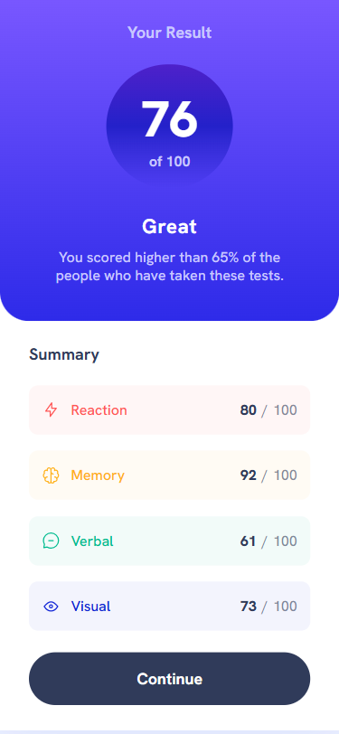
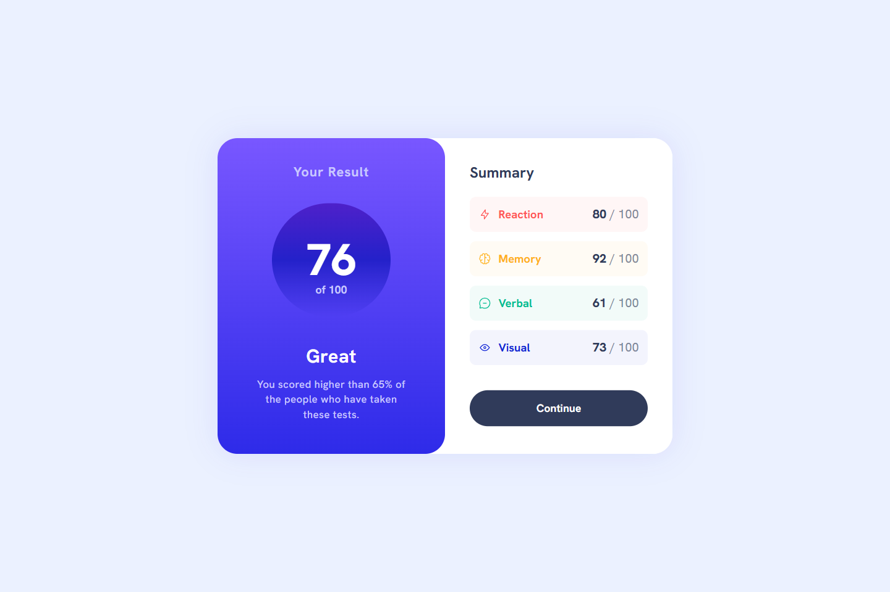
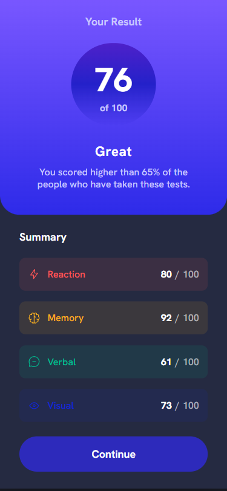
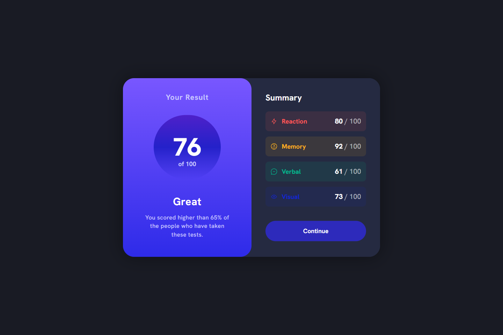

# 💻 Results Summary Component

## ℹ️ A Responsive Results Summary Component for a Test Result

| _Mobile Preview (375x812)_                                   | _Desktop Preview (1440x960)_                                    |
| ------------------------------------------------------------ | --------------------------------------------------------------- |
|       |       |
|  |  |

A clean, accessible, and visually engaging test results component designed using HTML and CSS. The layout adapts beautifully across screen sizes and supports dark mode.

Created as part of the building challenges from [Frontend Mentor](https://www.frontendmentor.io/).

---

## 🔍 Overview

This project replicates a summary results card for test scores using a mobile-first, responsive layout. The left section presents a performance score with a gradient background, while the right side lists category-based results. The design is built from a static image and matched closely using tools like [PerfectPixel](https://chromewebstore.google.com/detail/perfectpixel-by-welldonec/dkaagdgjmgdmbnecmcefdhjekcoceebi).

Accessibility was prioritized through ARIA labels, semantic HTML5 structure, skip links, and light/dark theme compatibility via the `prefers-color-scheme` media query. Transitions respect reduced motion settings to ensure inclusivity.

---

## ✨ Features

- Responsive layout using `flexbox` and `clamp()`
- Custom theme switching with `prefers-color-scheme: dark`
- Semantic HTML for screen readers
- Animated hover/focus states for call-to-action
- Color-coded categories for clarity
- Font loading using `@font-face` and local hosting
- Optimized for mobile, tablet, and desktop screens
- Accessibility enhancements with ARIA and skip links
- Smooth transitions for modern user experience
- Lighthouse-audited for performance and accessibility

---

## 🧠 What I Learned

- How to structure a two-column layout using mobile-first Flexbox
- Implemented a complete light/dark theme system using CSS variables
- Refined my use of `clamp()` and media queries for fluid typography
- Practiced accessibility techniques such as skip links, `aria-hidden`, and `outline-offset`
- Applied transition animations while respecting `prefers-reduced-motion`
- Improved my use of gradient backgrounds and color contrast ratios
- Learned how to properly handle font performance with `@font-face` self-hosting

---

## 🛠️ Tech Used

- HTML5
- CSS3
- Git
- GitHub
- Netlify

---

## 🎨 Design Reference & Tools

- JPG design image
- PerfectPixel

---

## 🚀 How to Run

1. Clone the repository
2. Open `index.html` in your browser

---

## 🌐 Live Demo

Or you can check out the 👉 [live website here](LINK)

---

## 📊 Performance Report

A **Google Lighthouse** audit was conducted on the final version of this project—view the full report [here](./assets/downloads/lighthouse-performance-report.pdf)

---

## 🧑‍💻 Author

Created by **Elmar Chavez**

🗓️ Month/Year: **June 2025**

📚 Journey: **3rd** month of learning _frontend web development_.

<!--

FRONTEND MENTOR TAGS:
html css vscode git github netlify 3rd-month frontend-mentor project perfectpixel lighthouse

-->
